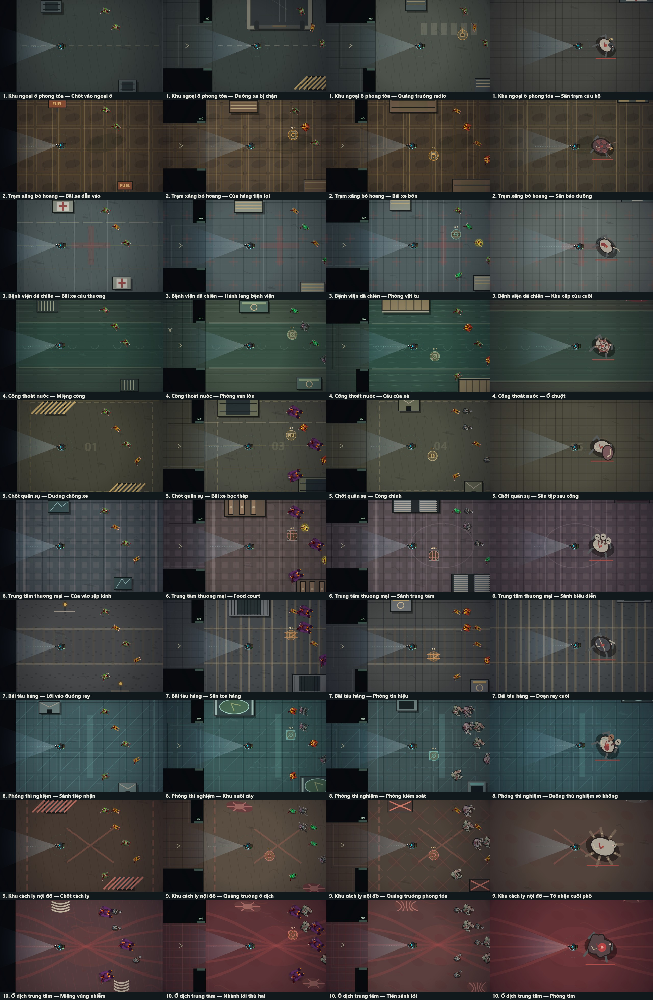

# Undead Rush

**Undead Rush** là game hành động bắn zombie góc nhìn từ trên xuống. Chiến đấu qua các khu vực nhiễm bệnh, giữ đường thoát và chuẩn bị cho những trận trùm ngày càng khốc liệt.

**[Chơi ngay trên Vercel](https://undead-rush.vercel.app/)** · [Mã nguồn trên GitHub](https://github.com/lightning09512/Undead-Rush)

## Ảnh trong game

Tổng hợp các khu vực và đấu trường trùm của 10 màn Chiến dịch:



## Chế độ chơi

- **Chiến dịch:** 10 màn có mục tiêu, khu vực và trùm riêng. Chọn độ khó Bình thường, Khó hoặc Cực khó trước khi bắt đầu.
- **Sinh tồn:** chống lại các đợt xác sống ngày càng dồn dập, tích lũy XP, chọn nâng cấp trong lượt và đối đầu trùm.
- Chọn nhân vật với thế mạnh riêng; thu thập vũ khí, đạn và vật phẩm hỗ trợ để thích nghi với trận chiến.

## Điều khiển

| Thao tác | Phím / nút |
| --- | --- |
| Di chuyển | `WASD` hoặc phím mũi tên |
| Ngắm và bắn | Chuột để ngắm, giữ chuột trái để bắn |
| Chuyển vũ khí | Phím số hoặc lăn con lăn chuột |
| Nạp đạn | `R` |
| Lựu đạn | `G` hoặc chuột phải |
| Lướt né | `Shift` |
| Kích hoạt nộ | `F` (`E` trong Sinh tồn) |
| Tương tác trong Chiến dịch | `E` |
| Tạm dừng | `Esc` hoặc `P` |

Trên thiết bị cảm ứng, dùng cần điều khiển ảo để di chuyển, ngắm và bắn.

## Chạy tại máy

Cần có Node.js và npm.

```bash
npm install
npm run dev
```

Các lệnh khác:

```bash
npm run build    # Kiểm tra TypeScript và tạo bản build
npm run preview  # Xem thử bản build
```

## Công nghệ

TypeScript, Vite và HTML Canvas. Cài đặt ngôn ngữ, âm thanh và tiến trình chơi được lưu trong trình duyệt.

---

[Mở Undead Rush](https://undead-rush.vercel.app/)
